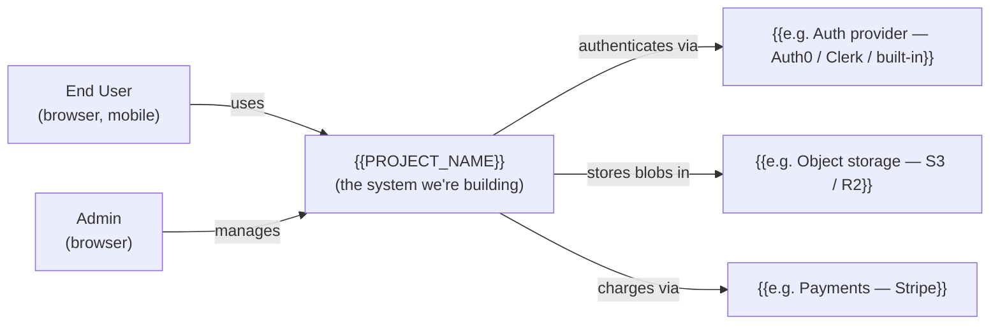
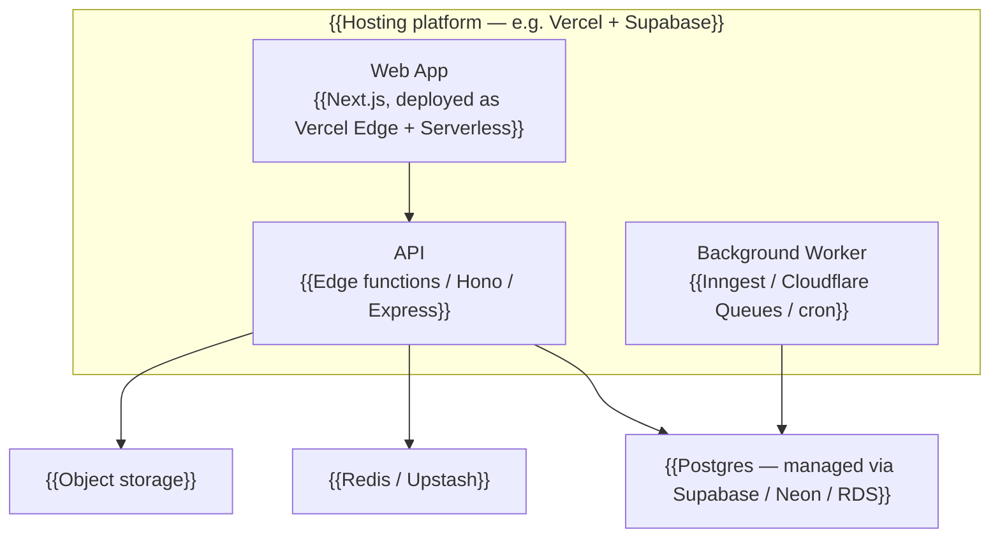

# 00 — System Overview

## What is this system?

{{ONE_PARAGRAPH_SYSTEM_DESCRIPTION}}

**System type:** {{e.g. Web application | Mobile app | Desktop app | CLI tool | Library | Distributed system | Embedded system | Hybrid}}

**Primary surface(s):** {{e.g. Browser (responsive web) + iOS native | Web only | CLI + JSON API | Library consumed by other apps}}

## Who uses it?

| User type      | How they reach the system                          | Frequency / context              |
|----------------|----------------------------------------------------|-----------------------------------|
| {{End user}}   | Browser at {{example.com}}                         | Daily, mostly mobile.            |
| {{Admin}}      | Same UI, role-flagged                              | Weekly, desktop.                  |
| {{API client}} | {{HTTPS REST}} at {{api.example.com}}              | Programmatic, intermittent.       |

## System Context (C4 Level 1)

The system in the middle, the people and external systems it interacts with around it.

*Replace placeholders with the real names. Delete arrows that don't apply.*

## Container View (C4 Level 2) — major moving parts

The pieces that actually run somewhere. Typically: an app, an API, a DB, a worker. Sometimes just one app.

*Keep it to the components that matter at this stage. Don't pre-design microservices. Start with the smallest set that captures reality.*

| Container       | Responsibility                                  | Technology                                   |
|-----------------|--------------------------------------------------|----------------------------------------------|
| Web App         | UI, user interactions                            | {{Next.js / React / Vue / Svelte}}           |
| API             | Business logic, authn/authz, persistence         | {{Same as web, or separate service}}         |
| Worker          | Async work (emails, exports, scheduled tasks)    | {{Inngest / Cloudflare Queues / cron job}}   |
| Database        | Persistent app state                             | {{Postgres / MySQL / SQLite}}                |
| Cache           | Session / rate-limit / hot data                  | {{Redis / Upstash}}                          |
| Blob            | User uploads, exports, large files               | {{S3 / R2 / Supabase Storage}}               |

## Why this shape?

One paragraph explaining the *style* of the architecture (monolith, modular monolith, serverless, microservices, JAMstack, event-driven, etc.) and *why* — what made this fit better than the alternatives.

See `references/architecture-patterns.md` *(in the initial-design skill)* for a catalogue of patterns and when each fits.

## What this overview deliberately does NOT cover

- Deployment / runtime detail → `01-stack-and-hosting.md`
- Storage detail → `02-data-and-storage.md`
- External APIs in detail → `03-external-integrations.md`
- Major decisions and trade-offs → `04-decisions.md`
- Unresolved architectural questions → `05-open-questions.md`
