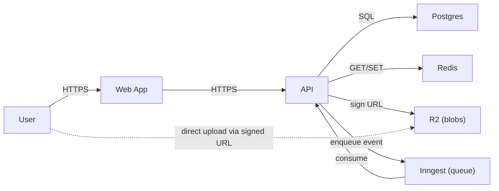

# 02 — Data and Storage

## Storage by class

| Class                | Store                                  | Why                                                    |
|----------------------|----------------------------------------|---------------------------------------------------------|
| Relational app state | {{Postgres on Supabase}}               | Strong consistency, well-known query model.            |
| Cache / sessions     | {{Upstash Redis}}                      | Fast key-value, fits session and rate-limit shapes.    |
| Blob / files         | {{Cloudflare R2}}                       | S3-compatible, no egress fees, generous free tier.     |
| Search *(if any)*    | {{Postgres full-text / Typesense / MeiliSearch}} | {{Postgres FTS sufficient for early scale}}   |
| Analytics events     | {{PostHog / event table in Postgres + dbt}} | {{}}                                              |
| Logs / metrics       | *(see `01-stack-and-hosting.md`)*       |                                                         |

## Supabase Postgres connection modes

*(Include if Supabase is the database. Delete otherwise.)*

Supabase exposes three connection modes. **Do not use the Direct connection in CI or serverless** — it is IPv6-only by default and unreachable from GitHub Actions runners and most dev machines (requires a paid IPv4 add-on to fix).

| Mode | Host | Port | IPv4 | DDL / migrations | Prepared statements | Use for |
|------|------|------|------|-----------------|---------------------|---------|
| Direct | `db.<ref>.supabase.co` | 5432 | ❌ IPv6-only | Yes | Yes | Local dev with Supabase CLI only |
| **Session pooler** | `aws-<region>.pooler.supabase.com` | **5432** | ✅ | Yes | Yes | **CI migrations** (`MIGRATION_DATABASE_URL`) |
| **Transaction pooler** | `aws-<region>.pooler.supabase.com` | **6543** | ✅ | No | No | **Serverless runtime** (`DATABASE_URL`) |

Pooler username format: `postgres.<project-ref>` (not `postgres`).

**Required env var split** — two separate vars prevent the wrong URL going to the wrong consumer:

```
# Vercel / Edge Functions — Transaction pooler, prepare: false in Postgres client
DATABASE_URL=postgres://postgres.<ref>:[PASSWORD]@aws-<region>.pooler.supabase.com:6543/postgres

# drizzle-kit / CI migrations — Session pooler, DDL-capable
MIGRATION_DATABASE_URL=postgres://postgres.<ref>:[PASSWORD]@aws-<region>.pooler.supabase.com:5432/postgres
```

**Automated migrations** — add a GitHub Actions workflow that runs `drizzle-kit migrate` (or equivalent) on merge to `main` when files under the migrations directory change, using `MIGRATION_DATABASE_URL`. Migrations should not be a manual step.

---

## Top-level entities (initial sketch)

What this system stores. Not a full schema — just the shape.

| Entity          | Owned by this system? | Notes                                                  |
|-----------------|------------------------|--------------------------------------------------------|
| User            | Yes                    | Identity is partially Auth provider's (see 03-).       |
| Account / Org   | Yes                    | One User can belong to multiple Accounts.              |
| {{Resource X}}  | Yes                    | The main business object. Owned by an Account.         |
| {{Resource Y}}  | Yes                    | Audit / history of changes to Resource X.              |
| {{Sub-resource}}| Yes                    | Nested under Resource X.                                |

## Data sensitivity

| Sensitivity class       | Examples in this system                              | Handling                                                  |
|-------------------------|------------------------------------------------------|-----------------------------------------------------------|
| Public                  | Marketing pages, public Resource X content (if any). | No special handling.                                       |
| Internal                | Resource X content (private), Account names.         | Encrypted at rest by the managed DB; access via authz.    |
| Confidential            | User email, billing details.                         | Encrypted at rest; access logged.                         |
| Restricted (special-cat)| {{PII, health info, payment data — only if relevant}} | {{TLS in transit; column-level encryption}}             |

## Retention

| Data                        | Retention                                           |
|-----------------------------|------------------------------------------------------|
| User account                | Life of account + 30 days after deletion (backups age out). |
| User-generated content      | Same as account.                                     |
| Audit logs                  | {{e.g. 12 months}}                                   |
| Application logs            | {{e.g. 30 days}}                                     |
| Analytics events            | {{e.g. 13 months for cohort analysis}}               |
| Backups                     | {{e.g. Daily, retained 30 days, plus monthly archives 12 months}} |

## Data flow at a glance



*Edit to reflect the actual flow.*

## Multi-region / single-region

{{Single region for v1 — us-east-1.}}
{{Reasons: Latency to primary user base is acceptable; multi-region adds significant operational complexity; budget constrained.}}

When we revisit: {{e.g. when EU users exceed 20% of traffic OR when GDPR data-residency becomes a contractual requirement.}}
