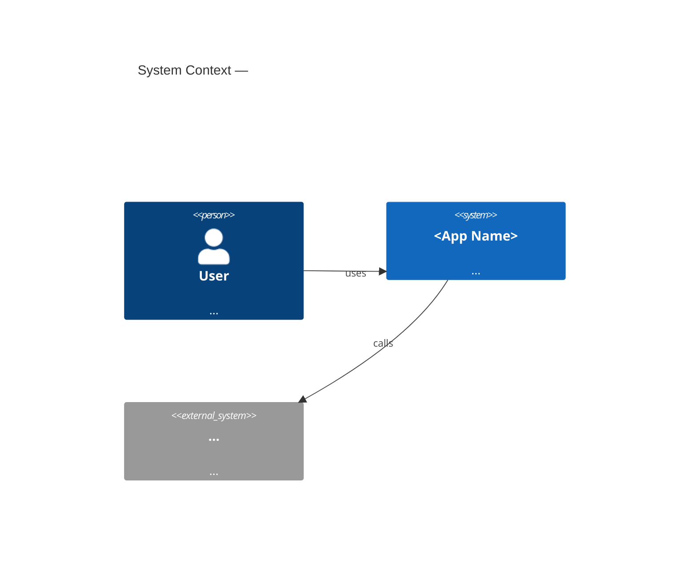

Produce BA-quality as-built documentation from a running application. The capture work is delegated to a `describe-ui-from-*` skill; this skill handles routing, synthesis, and the final artifact set.

## Inputs

Accept any of these as starting points:

- **App type known, app running** — ask which platform, then invoke the matching capture skill
- **App type unknown** — ask 1–2 questions to determine the platform (see routing table below)
- **UI description already captured** — if `docs/as-built/ui-description/` exists from a prior run, skip straight to Step 2

## Platform routing table

| Signal | Skill to invoke |
|---|---|
| URL provided, browser app | `/describe-ui-from-web-app` |
| `.exe`, running Windows process, WPF/WinForms mentioned | `/describe-ui-from-windows-app` |
| APK, Android emulator, ADB mentioned | `/describe-ui-from-android-app` |
| iOS, iPhone, Xcode simulator, `.ipa` mentioned | `/describe-ui-from-ios-app` |

If ambiguous after one clarifying question, default to web.

---

## Step 1 — Invoke the capture skill

Tell the user which `describe-ui-from-*` skill you are invoking and why. Invoke it as a slash command (e.g. `/describe-ui-from-web-app`) — all four are registered skills in this same plugin. Do not summarise or shortcut the capture skill — run it completely.

When the capture skill finishes, `docs/as-built/ui-description/` will contain:
- `screen-inventory.md` — table of all discovered screens
- `screens/<name>.md` — per-screen ARIA/hierarchy dumps + field observations
- `api-spec.yaml` (web only) — draft OpenAPI spec

---

## Step 2 — LLM synthesis pass

Read the full contents of `docs/as-built/ui-description/` and produce the following files under `docs/as-built/`. Create the directory if it does not exist.

### `functional-spec.md`

One section per screen. For each screen include:

```markdown
## <Screen Name>
**Route/path:** <url or nav path>
**Roles with access:** <list>
**Entry points:** <how users arrive here>

### Fields
| Label | Type | Required | Default | Validation | Notes |
|-------|------|----------|---------|------------|-------|

### Business rules
(Conditional logic, calculations, workflow rules observed on this screen)

### Flows
- **Main flow:** <step-by-step narrative>
- **Alternate flows:** <branching paths>
- **Exception flows:** <error states, validation failures>

### Navigation
(Where this screen leads; what triggers each transition)
```

### `data-dictionary.md`

One row per unique field across the entire app. Normalise duplicates (same field appearing on multiple screens = one row with a "screens" column).

```markdown
| Field name | Label | Type | Size | Required | Default | Validation rules | Business rules | Source/target | Screens |
```

### `business-rules.md`

```markdown
| ID | Name | Description | Example | Source (screen/flow) | Decision table? |
```

Number rules BR-001, BR-002, etc. Use a decision table (markdown table) for any rule with 3+ conditions.

### `context-diagram.md`

Produce a Mermaid C4 context diagram. Infer external systems from:
- API calls observed in `api-spec.yaml` (web)
- Domain names in network requests
- Third-party SDK names visible in UI
- Auth provider screens (login pages, OAuth redirects)



### `use-cases.md`

Identify 5–10 major use cases from the captured flows. For each:

```markdown
## UC-<N>: <Name>
**Actors:** <roles>
**Preconditions:** <state before>
**Main flow:**
1. ...
**Alternate flows:**
- ...
**Exception flows:**
- ...
**Postconditions:** <state after>
```

---

## Step 3 — Gap review

After writing all artifacts, compile a **gap list** and present it to the user:

```
Gaps found during this capture run:
- Auth-gated screens not captured: [list]
- Business rules inferred (unconfirmed): [list]
- Fields with ambiguous type: [list]
- Integrations spotted but not documented: [list]
- Screens with incomplete hierarchy capture: [list]
```

Run a short Q&A to fill the gaps. Update the affected sections in the artifact files.

---

## Step 4 — Commit

Stage all files under `docs/as-built/` and commit following [`../../shared/commit-push-policy.md`](../../shared/commit-push-policy.md).

Use commit message: `docs(as-built): reverse-engineer <app name> — functional spec, data dictionary, business rules, context diagram, use cases`

---

## Guardrails

- The synthesis pass will hallucinate some details — the gap review is the quality gate, not optional
- Do not invent business rules not supported by the captured data; mark them as inferred
- Do not merge `docs/as-built/` into `docs/requirements/` — they are separate artifact families; a future `/requirements-from-as-built` skill handles that promotion
- If the capture skill was unable to reach more than 30% of screens (auth-gated, tooling failure), warn the user before synthesising — a partial capture produces a misleading spec
